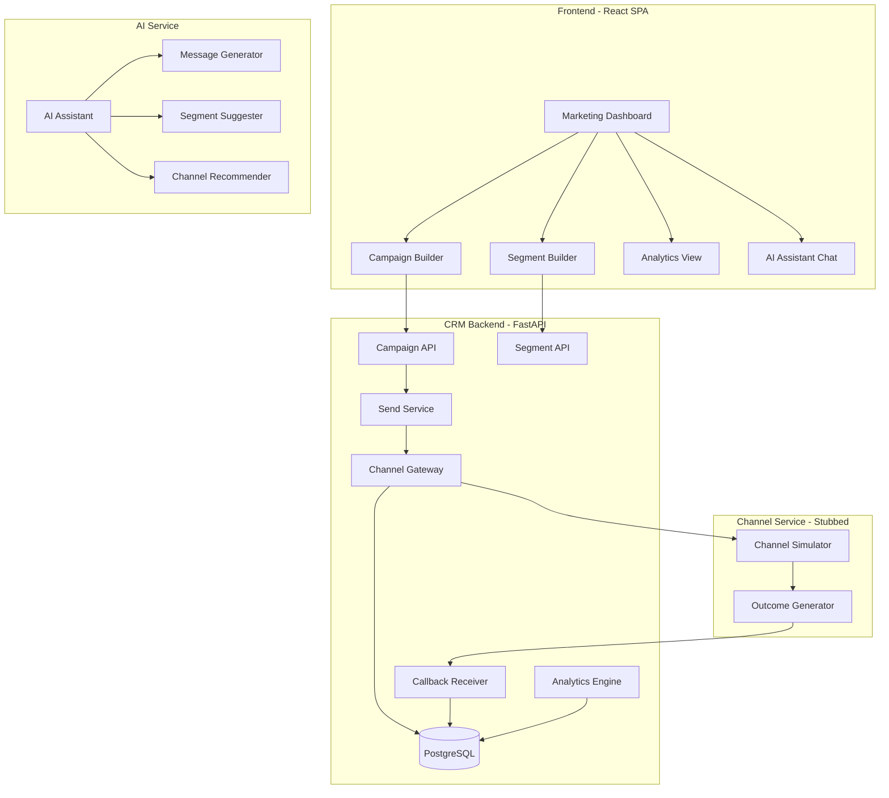
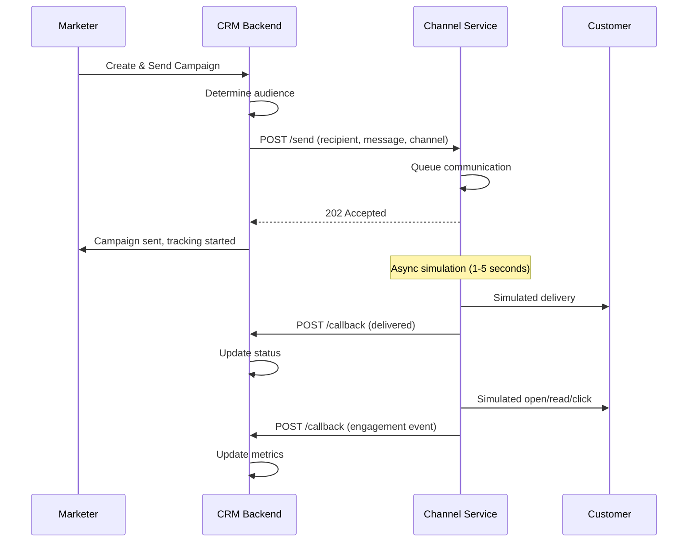
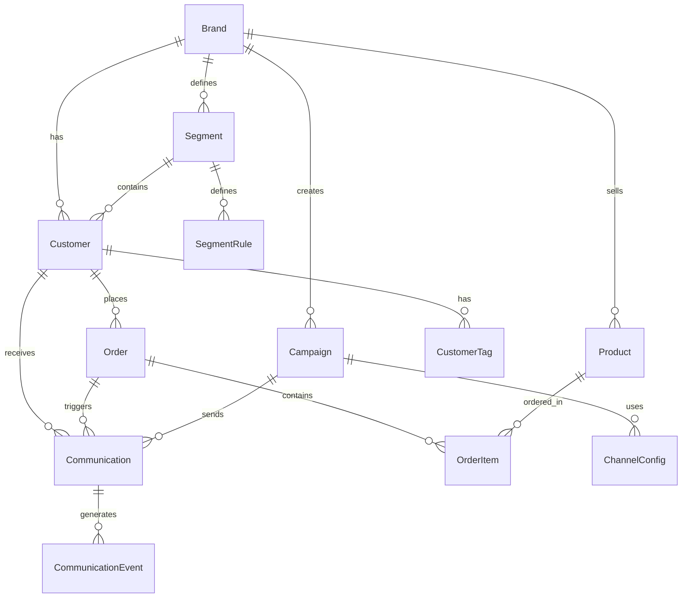
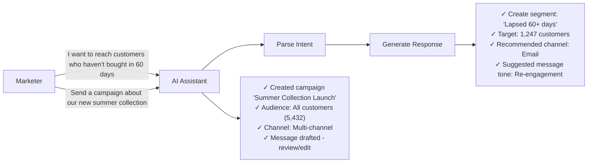
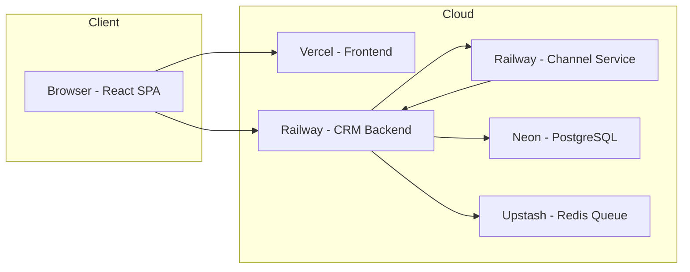

# Xeno Mini CRM - AI-Native Marketing & Engagement Platform

## 1. Project Overview

**Project Name:** Xeno Mini CRM  
**Type:** AI-Native Mini CRM for Consumer Brands  
**Core Functionality:** Help brands intelligently reach shoppers by managing customer data, segmenting audiences, sending personalized campaigns, and tracking performance.

**Target Users:** Direct-to-Consumer (DTC) brands - fashion, beauty, food & beverage, retail

**Key Constraints:**
- NOT a sales/support CRM (no deals, pipelines, leads, tickets)
- IS a marketing/engagement tool for reaching consumers
- Must be AI-native (AI woven into product, not bolted on)
- Two-service architecture with callback-driven communication tracking

---

## 2. Core Features

### 2.1 Data Ingestion
- Customer profile management (name, email, phone, demographics)
- Order history storage (products, quantities, dates, amounts)
- Purchase behavior tracking
- Realistic simulated data generation

### 2.2 Audience Segmentation
- Rule-based segment builder
- AI-assisted segment suggestions
- Behavioral attributes (purchase frequency, recency, value)
- Demographic attributes (age, location, gender)
- Dynamic segment updates

### 2.3 Campaign Management
- Multi-channel campaigns (WhatsApp, SMS, Email, RCS)
- Message personalization with tokens
- Campaign scheduling
- A/B testing support

### 2.4 Channel Service (Stubbed)
- Separate service that simulates message delivery
- Models full communication lifecycle
- Generates realistic outcomes (delivered, failed, opened, read, clicked)
- Calls back to CRM with status updates
- Handles volume, ordering, retries

### 2.5 Performance Analytics
- Campaign-level metrics (sent, delivered, failed, opened, read, clicked)
- Audience-level engagement breakdown
- Revenue attribution (orders influenced by communication)
- Visual dashboard

### 2.6 AI-Native Features
- **AI-Assisted Message Drafting** - Generate personalized message variants
- **Smart Segment Suggestions** - AI recommends audiences based on campaign goals
- **Natural Language Interface** - Marketer describes intent, AI builds segment/campaign
- **Channel Recommendation** - AI suggests best channel for each audience

---

## 3. System Architecture



---

## 4. Two-Service Architecture

### 4.1 CRM Service (Port 8000)
- Handles all business logic
- Manages customers, orders, segments, campaigns
- Exposes send API for campaigns
- Receives callbacks from channel service
- Serves frontend

### 4.2 Channel Service (Port 8001)
- Stubbed messaging provider
- Receives communications from CRM
- Simulates delivery outcomes
- Calls back to CRM receipt API
- Models realistic async behavior

### 4.3 Communication Flow


---

## 5. Database Schema

### 5.1 Entity Relationship



### 5.2 Core Tables

| Table | Purpose |
|-------|---------|
| `brands` | Tenant/workspace |
| `customers` | Shopper profiles |
| `products` | Product catalog |
| `orders` | Purchase records |
| `order_items` | Line items |
| `tags` | Customer categorization |
| `segments` | Audience definitions |
| `segment_rules` | Segmentation criteria |
| `campaigns` | Marketing campaigns |
| `campaign_messages` | Message templates |
| `communications` | Individual messages sent |
| `communication_events` | Tracking events |
| `ai_suggestions` | AI-generated recommendations |

### 5.3 Communication Event Types
```sql
enum event_type {
    queued,
    sent,
    delivered,
    failed,
    opened,
    read,
    clicked,
    unsubscribed,
    bounced
}
```

---

## 6. API Design

### 6.1 CRM Service Endpoints

```
# Brand/Auth
POST   /api/auth/register
POST   /api/auth/login
GET    /api/auth/me

# Customers
GET    /api/customers              # List with filters
POST   /api/customers              # Create
GET    /api/customers/{id}         # Get with orders
PUT    /api/customers/{id}         # Update
DELETE /api/customers/{id}         # Delete
GET    /api/customers/{id}/timeline # Activity history
POST   /api/customers/import       # Bulk import

# Orders
GET    /api/orders
POST   /api/orders
GET    /api/orders/{id}

# Segments
GET    /api/segments
POST   /api/segments
GET    /api/segments/{id}
PUT    /api/segments/{id}
DELETE /api/segments/{id}
POST   /api/segments/{id}/preview  # Preview matching customers
POST   /api/segments/ai-suggest    # AI suggest segment

# Campaigns
GET    /api/campaigns
POST   /api/campaigns
GET    /api/campaigns/{id}
PUT    /api/campaigns/{id}
DELETE /api/campaigns/{id}
POST   /api/campaigns/{id}/send    # Trigger send
GET    /api/campaigns/{id}/stats   # Performance metrics

# AI Assistant
POST   /api/ai/chat                # Natural language interface
POST   /api/ai/suggest-message     # Generate message variants
POST   /api/ai/suggest-channel     # Recommend channel

# Callbacks (from Channel Service)
POST   /api/callbacks/delivery     # Delivery status
POST   /api/callbacks/engagement   # Open/click/unsubscribe

# Analytics
GET    /api/analytics/overview     # Dashboard summary
GET    /api/analytics/campaigns    # Campaign performance
GET    /api/analytics/audiences    # Segment engagement
```

### 6.2 Channel Service Endpoints

```
POST   /send                 # Receive communication from CRM
GET    /status/{id}          # Check communication status
POST   /batch-send           # Bulk send
```

---

## 7. Frontend Application Structure

```
frontend/
├── src/
│   ├── api/
│   │   ├── client.ts
│   │   ├── customers.ts
│   │   ├── campaigns.ts
│   │   ├── segments.ts
│   │   └── ai.ts
│   │
│   ├── components/
│   │   ├── ui/              # Button, Input, Card, Table, Modal
│   │   ├── layout/          # Sidebar, Header, PageContainer
│   │   ├── customers/       # CustomerTable, CustomerDetail
│   │   ├── campaigns/       # CampaignCard, MessageEditor
│   │   ├── segments/        # SegmentBuilder, RuleGroup
│   │   └── analytics/       # Chart, MetricCard, Dashboard
│   │
│   ├── features/
│   │   ├── dashboard/       # Overview page
│   │   ├── customers/       # Customer management
│   │   ├── segments/        # Segmentation
│   │   ├── campaigns/       # Campaign management
│   │   ├── analytics/       # Reporting
│   │   └── ai-assistant/    # AI chat interface
│   │
│   ├── hooks/
│   │   ├── useCustomers.ts
│   │   ├── useCampaigns.ts
│   │   └── useAI.ts
│   │
│   ├── lib/
│   │   └── utils.ts
│   │
│   └── types/
│       └── index.ts
```

---

## 8. Backend Application Structure

```
backend/
├── app/
│   ├── api/
│   │   ├── v1/
│   │   │   ├── auth.py
│   │   │   ├── customers.py
│   │   │   ├── orders.py
│   │   │   ├── segments.py
│   │   │   ├── campaigns.py
│   │   │   ├── analytics.py
│   │   │   ├── ai.py
│   │   │   └── callbacks.py
│   │   └── deps.py
│   │
│   ├── core/
│   │   ├── config.py
│   │   ├── security.py
│   │   └── database.py
│   │
│   ├── models/
│   │   ├── brand.py
│   │   ├── customer.py
│   │   ├── order.py
│   │   ├── segment.py
│   │   ├── campaign.py
│   │   ├── communication.py
│   │   └── ai.py
│   │
│   ├── schemas/
│   │   ├── customer.py
│   │   ├── campaign.py
│   │   └── ...
│   │
│   ├── services/
│   │   ├── customer_service.py
│   │   ├── campaign_service.py
│   │   ├── segment_service.py
│   │   ├── channel_service.py
│   │   ├── analytics_service.py
│   │   └── ai_service.py
│   │
│   ├── crud/
│   └── main.py

channel_service/
├── app/
│   ├── simulator.py         # Outcome generation
│   ├── queue.py             # Async processing
│   ├── callbacks.py         # CRM callback client
│   └── main.py
├── requirements.txt
```

---

## 9. AI-Native Features Design

### 9.1 AI Assistant Chat Interface


### 9.2 AI Feature Implementation
- **Message Generation**: Use LLM to generate personalized message variants
- **Segment Suggestions**: Analyze customer behavior to suggest high-value segments
- **Channel Recommendation**: Predict best channel based on customer engagement history
- **Natural Language to Actions**: Parse marketer intent and execute appropriate actions

---

## 10. Infrastructure & Deployment

### 10.1 Architecture



### 10.2 Deployment Stack

| Component | Service | Reason |
|-----------|---------|--------|
| Frontend | Vercel | Fast, free, easy React deploy |
| CRM Backend | Railway | Easy FastAPI deploy, good DX |
| Channel Service | Railway | Separate service, same benefits |
| Database | Neon | Serverless PostgreSQL, free tier |
| Queue | Upstash Redis | Cheap async job queue |

---

## 11. Implementation Phases

### Phase 1: Foundation
- [ ] Project setup (frontend + 2 backends)
- [ ] Database schema & migrations
- [ ] Authentication (brand signup/login)
- [ ] Customer CRUD + seed data

### Phase 2: Core CRM
- [ ] Order management
- [ ] Basic segmentation
- [ ] Campaign creation
- [ ] Channel Service stub

### Phase 3: Communication
- [ ] CRM → Channel Service integration
- [ ] Callback receiver
- [ ] Communication tracking
- [ ] Status updates

### Phase 4: Analytics
- [ ] Event ingestion
- [ ] Campaign metrics
- [ ] Dashboard views
- [ ] Performance charts

### Phase 5: AI-Native Features
- [ ] AI chat interface
- [ ] Message generation
- [ ] Segment suggestions
- [ ] Channel recommendations

---

## 12. Scale Assumptions & Tradeoffs

### What I Would Do at Scale
- **Database**: Sharding by brand_id for multi-tenant isolation
- **Queue**: Use proper message queue (RabbitMQ, SQS) for channel callbacks
- **Caching**: Redis for segment membership caching
- **CDN**: Cloudflare for static assets and API caching
- **Monitoring**: Add DataDog/New Relic for observability

### Tradeoffs Made for This Scope
- Using in-memory queue instead of proper message broker
- Single database instance (would shard at scale)
- Stubbed channel service (would integrate real providers)
- Basic AI features (would add more sophisticated ML models)

---

## 13. Technology Stack

| Layer | Technology |
|-------|------------|
| Frontend | React 18, TypeScript, Vite, TailwindCSS, Recharts |
| CRM Backend | FastAPI, SQLAlchemy, Pydantic, Alembic |
| Channel Service | FastAPI, asyncio, httpx |
| Database | PostgreSQL (Neon) |
| AI | kimchi.dev (OpenAI-compatible API) |
| Auth | JWT with refresh tokens |

### 13.1 AI Configuration (kimchi.dev)

```python
# AI Service Configuration
KIMCHI_BASE_URL = "https://api.kimchi.dev/v1"  # OpenAI-compatible base URL
KIMCHI_API_KEY = os.getenv("KIMCHI_API_KEY")
MODEL = "minimax-2.7"  # Or any model available on kimchi.dev

# OpenAI-compatible client usage
from openai import OpenAI

client = OpenAI(
    base_url=KIMCHI_BASE_URL,
    api_key=KIMCHI_API_KEY
)

response = client.chat.completions.create(
    model=MODEL,
    messages=[{"role": "user", "content": "Hello"}]
)
```