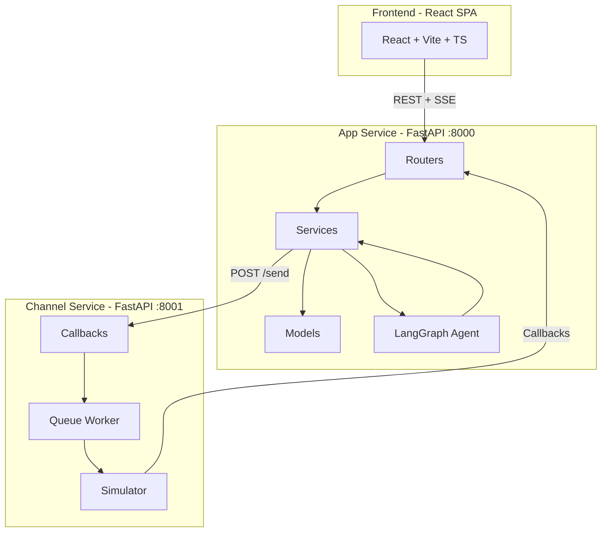
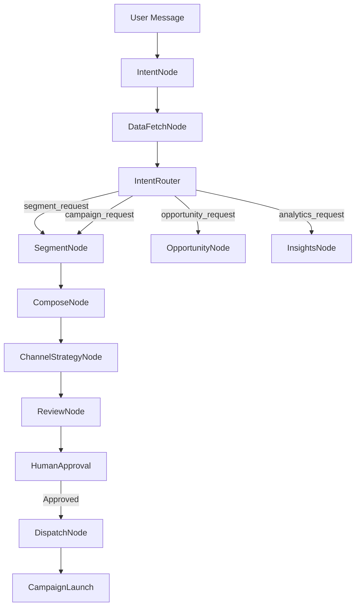
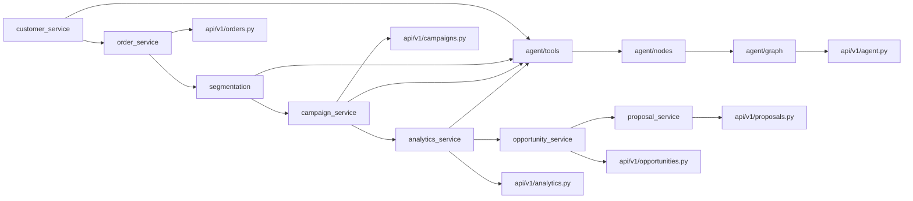

# Backend Implementation Plan - Xeno AI Campaign Intelligence Platform

## Based on: CLAUDE.md Specification

This plan implements the backend components according to the CLAUDE.md architecture specification.

---

## Architecture Overview



---

## Phase 1: Service Layer (7 files)

### 1.1 [ ] `backend/app/services/customer_service.py`
**Responsibilities (per CLAUDE.md):**
- Create Customers
- Update Customers
- Customer Search
- Customer Import
- Customer Statistics

**Must support:** search, pagination, filtering

```python
# Key functions:
def create_customer(db, brand_id, customer_data) -> Customer
def update_customer(db, customer_id, data) -> Customer
def search_customers(db, brand_id, query, pagination) -> List[Customer]
def get_customer_stats(db, customer_id) -> dict  # ltv, total_orders, etc.
def import_customers(db, brand_id, customers_data) -> int  # count
```

### 1.2 [ ] `backend/app/services/order_service.py`
**Responsibilities (per CLAUDE.md):**
- Order Import
- Order Listing
- Customer Order History
- LTV Recalculation

```python
# Key functions:
def create_order(db, brand_id, order_data) -> Order
def get_customer_orders(db, customer_id, limit) -> List[Order]
def calculate_customer_ltv(db, customer_id) -> float
def import_orders(db, brand_id, orders_data) -> int
```

### 1.3 [ ] `backend/app/services/segmentation.py`
**Responsibilities (per CLAUDE.md):**
- Convert filter rules into SQLAlchemy queries
- Preview Segments
- Count Customers
- Return Sample Customers
- Save Segments

**Supported operators:** `>`, `<`, `=`, `contains`, `in`, `between`

```python
# Key functions:
def preview_segment(db, brand_id, rules, limit) -> List[Customer]
def count_segment_customers(db, brand_id, rules) -> int
def evaluate_segment(db, segment_id) -> List[Customer]
def save_segment(db, brand_id, segment_data) -> Segment
```

### 1.4 [ ] `backend/app/services/campaign_service.py` (or `campaign.py`)
**Responsibilities (per CLAUDE.md):**
- Campaign Creation
- Campaign Launch
- Message Personalization
- Communication Creation
- Channel Dispatch

**Campaign Creation Flow:**
```
Create Campaign → Store Campaign → Draft State
```

**Campaign Launch Flow:**
```
Load Segment → Load Customers → Personalize Message → Create Communications → Send Jobs → Status = Running
```

```python
# Key functions:
def create_campaign(db, brand_id, campaign_data) -> Campaign
def launch_campaign(db, campaign_id) -> dict  # creates communications
def personalize_message(template: str, customer: Customer) -> str
def create_communications(db, campaign_id, customers) -> int  # count
def dispatch_to_channel_service(communications) -> bool
```

### 1.5 [ ] `backend/app/services/analytics_service.py` (or `analytics.py`)
**Responsibilities (per CLAUDE.md):**
- Dashboard KPIs
- Channel Statistics
- Campaign Statistics
- Funnels
- Revenue Attribution

**Analytics Principle:** Never generate fake metrics. Everything from `communications` and `communication_events` tables.

```python
# Key functions:
def get_overview_metrics(db, brand_id) -> dict
def get_channel_stats(db, brand_id) -> List[dict]
def get_campaign_stats(db, campaign_id) -> dict
def get_funnel_metrics(db, campaign_id) -> dict
def get_revenue_attribution(db, brand_id, campaign_id) -> float
```

### 1.6 [ ] `backend/app/services/opportunity_service.py` (or `opportunity.py`)
**Responsibilities (per CLAUDE.md):**
- Discover revenue opportunities
- Create Opportunity rows for frontend

**Supported scans:**
- VIP Retention
- Inactive High Value Users
- Cross Sell
- Upsell
- Reactivation
- Category Affinity

```python
# Key functions:
def scan_opportunities(db, brand_id) -> List[Opportunity]
def get_opportunity_details(db, opportunity_id) -> Opportunity
def convert_opportunity(db, opportunity_id) -> Campaign
def dismiss_opportunity(db, opportunity_id) -> bool
```

### 1.7 [ ] `backend/app/services/proposal_service.py` (or `proposal.py`)
**Responsibilities (per CLAUDE.md):**
- Create Proposal
- Approve Proposal
- Reject Proposal
- Convert Proposal To Campaign

**Approval Flow:**
```
AI Agent → Proposal → Approve → Campaign → Launch
```

```python
# Key functions:
def create_proposal(db, brand_id, proposal_data) -> AgentProposal
def approve_proposal(db, proposal_id) -> Campaign  # launches campaign
def reject_proposal(db, proposal_id) -> bool
def get_pending_proposals(db, brand_id) -> List[AgentProposal]
```

---

## Phase 2: LangGraph Agent System

### 2.1 [ ] `backend/app/agent/state.py`
**Per CLAUDE.md:**

```python
class AgentState(TypedDict):
    session_id: str
    messages: list
    intent: str
    context: dict
    pending_segment: dict | None
    pending_messages: list | None
    pending_campaign: dict | None
    current_step: str
    stream_callback: Any
```

### 2.2 [ ] `backend/app/agent/graph.py`
**Per CLAUDE.md:**



### 2.3 [ ] `backend/app/agent/nodes/intent.py`
**Purpose:** Classify user intent

**Allowed intents:**
- `segment_request`
- `campaign_request`
- `analytics_request`
- `opportunity_request`
- `system_request`
- `general_request`

### 2.4 [ ] `backend/app/agent/nodes/data_fetch.py`
**Purpose:** Collect CRM context (Customer Stats, Segment Data, Campaign Data, Analytics Data)

### 2.5 [ ] `backend/app/agent/nodes/segment.py`
**Purpose:** Create audiences from natural language

**Output:**
```json
{
  "segment_name": "Inactive Customers",
  "reasoning": "...",
  "filter_rules": [...],
  "expected_size": 1200
}
```

### 2.6 [ ] `backend/app/agent/nodes/compose.py`
**Purpose:** Generate campaign copy for all channels

**Output:**
```json
{
  "whatsapp": ["message1", "message2"],
  "sms": ["message1", "message2"],
  "email": ["subject1 + body1", "subject2 + body2"]
}
```

### 2.7 [ ] `backend/app/agent/nodes/channel_strategy.py`
**Purpose:** Recommend best channel

**Output:**
```json
{
  "recommended_channel": "whatsapp",
  "confidence": 0.85,
  "reasoning": "..."
}
```

### 2.8 [ ] `backend/app/agent/nodes/review.py`
**Purpose:** Create final campaign proposal

**Output:**
```json
{
  "campaign_name": "...",
  "summary": "...",
  "channel": "...",
  "expected_outcome": "...",
  "risks": "..."
}
```

### 2.9 [ ] `backend/app/agent/nodes/opportunities.py`
**Purpose:** Find revenue opportunities

### 2.10 [ ] `backend/app/agent/nodes/insights.py`
**Purpose:** Convert analytics into recommendations

### 2.11 [ ] `backend/app/agent/nodes/dispatch.py`
**Purpose:** Execute approved campaigns (NEVER makes decisions)

### 2.12 [ ] `backend/app/agent/tools/customer_tools.py`
### 2.13 [ ] `backend/app/agent/tools/analytics_tools.py`
### 2.14 [ ] `backend/app/agent/tools/campaign_tools.py`
### 2.15 [ ] `backend/app/agent/tools/segment_tools.py`

---

## Phase 3: API Updates

### 3.1 [ ] Create `backend/app/api/v1/orders.py`
**Missing router for Order CRUD**

Endpoints:
- `GET /orders` - List orders with filters
- `POST /orders` - Create order
- `GET /orders/{id}` - Get order details
- `PUT /orders/{id}` - Update order

### 3.2 [ ] Update `backend/app/api/v1/agent.py`
**Replace mock SSE with real LangGraph**

Current: Mock streaming response
Required: Real LangGraph integration with SSE streaming

**SSE Event Types (per CLAUDE.md):**
```json
{"type": "text", "content": "..."}
{"type": "segment_proposal", "data": {}}
{"type": "message_proposal", "data": {}}
{"type": "campaign_proposal", "data": {}}
{"type": "opportunity", "data": {}}
{"type": "insight", "data": {}}
{"type": "done"}
```

### 3.3 [ ] Update `backend/app/api/v1/campaigns.py`
**Use campaign_service instead of inline logic**

### 3.4 [ ] Update `backend/app/api/v1/analytics.py`
**Use analytics_service instead of inline logic**

### 3.5 [ ] Update `backend/app/api/v1/opportunities.py`
**Use opportunity_service for scan_opportunities**

### 3.6 [ ] Update `backend/app/api/v1/proposals.py`
**Use proposal_service for approve/reject**

---

## Phase 4: Receipt Processing (Callbacks)

### 4.1 [ ] Update `backend/app/api/v1/callbacks.py`
**Ensure proper status FSM per CLAUDE.md:**

**Allowed transitions:**
```
queued → sent → delivered → opened → read → clicked → converted
                ↓
              failed
```

**Idempotency:** Duplicate events must not break state

---

## Phase 5: Repository Layer (OPTIONAL)

Per CLAUDE.md: "Repositories should never contain business logic"

**If implemented:**
- `backend/app/repositories/customer_repo.py`
- `backend/app/repositories/order_repo.py`
- `backend/app/repositories/campaign_repo.py`
- `backend/app/repositories/segment_repo.py`

**Note:** Can skip this and use services directly for faster implementation.

---

## Implementation Order for Working Demo

### Week 1: Foundation
1. [ ] customer_service.py
2. [ ] order_service.py
3. [ ] segmentation.py
4. [ ] Create orders.py router

### Week 2: Campaign & Analytics
5. [ ] campaign_service.py
6. [ ] analytics_service.py
7. [ ] Update campaigns.py
8. [ ] Update analytics.py

### Week 3: AI Services
9. [ ] opportunity_service.py
10. [ ] proposal_service.py
11. [ ] Update opportunities.py
12. [ ] Update proposals.py

### Week 4: LangGraph Agent
13. [ ] agent/state.py
14. [ ] agent/tools/ (4 files)
15. [ ] agent/nodes/ (9 files)
16. [ ] agent/graph.py
17. [ ] Update agent.py with real LangGraph + SSE

---

## File Summary

| Phase | File | Status |
|-------|------|--------|
| 1 | services/customer_service.py | NEW |
| 1 | services/order_service.py | NEW |
| 1 | services/segmentation.py | NEW |
| 1 | services/campaign_service.py | NEW |
| 1 | services/analytics_service.py | NEW |
| 1 | services/opportunity_service.py | NEW |
| 1 | services/proposal_service.py | NEW |
| 2 | agent/state.py | NEW |
| 2 | agent/graph.py | NEW |
| 2 | agent/nodes/intent.py | NEW |
| 2 | agent/nodes/data_fetch.py | NEW |
| 2 | agent/nodes/segment.py | NEW |
| 2 | agent/nodes/compose.py | NEW |
| 2 | agent/nodes/channel_strategy.py | NEW |
| 2 | agent/nodes/review.py | NEW |
| 2 | agent/nodes/opportunities.py | NEW |
| 2 | agent/nodes/insights.py | NEW |
| 2 | agent/nodes/dispatch.py | NEW |
| 2 | agent/tools/customer_tools.py | NEW |
| 2 | agent/tools/analytics_tools.py | NEW |
| 2 | agent/tools/campaign_tools.py | NEW |
| 2 | agent/tools/segment_tools.py | NEW |
| 3 | api/v1/orders.py | NEW |
| 3 | api/v1/agent.py | UPDATE |
| 3 | api/v1/campaigns.py | UPDATE |
| 3 | api/v1/analytics.py | UPDATE |
| 3 | api/v1/opportunities.py | UPDATE |
| 3 | api/v1/proposals.py | UPDATE |
| 4 | api/v1/callbacks.py | UPDATE |

**Total: 27 files (7 new services + 13 agent files + 7 API files)**

---

## Dependencies



---

## Success Criteria (per CLAUDE.md)

The backend should successfully support:
- Customer Management
- Segment Management
- Campaign Management
- Communication Lifecycle
- Analytics
- Opportunities
- Agent Proposals
- AI Agent
- Settings
- Receipt Processing

while maintaining clear service boundaries and production-quality code organization.